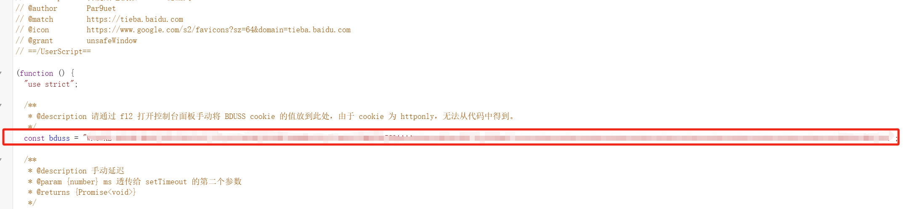
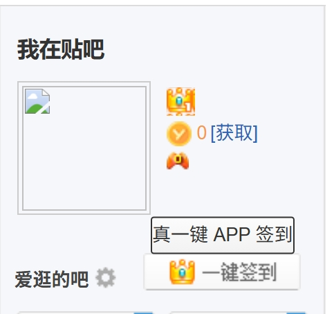

# 百度贴吧一键签到脚本

## 使用

### node 脚本

先登录网页贴吧，找到 tieba.baidu.com 的请求，把 cookie 复制出来：

放到 `index.js` 顶部的 `cookie` 变量内：

然后执行 `node index.js` 即可。

### 篡改猴脚本

#### web 签到

将 web-sign.js 的内容添加到篡改猴内，在贴吧的首页即可看见真一键签到按钮：

然后点击即可签到所有吧。

#### app 签到

将 app-sign.js 内容添加倒篡改猴内，然后打开 F12 找到 BDUSS 的 cookie ，复制到以下位置：

在贴吧的首页即可看见真一键 APP 签到按钮：

## 注意事项

web 签到只会调用贴吧的接口，而 app 签到会调用一个我部署在 vercel 上的接口，接口地址：https://tieba-sign.prohibitorum.top/tieba_app_sign ，该接口不会收集任何用户信息，只做单纯的接口转发，但如果你依然在意账号安全问题，请使用 web 签到。

关于 app 签到原理，其实就是分析了贴吧的 apk ，等有空的时候会在我的博客上写一篇帖子，然后公开相关仓库。