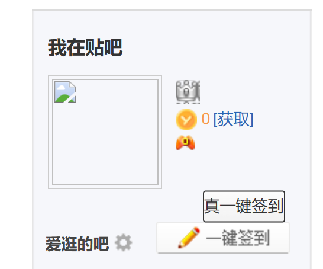

# 百度贴吧一键签到脚本

## 使用

### node 脚本

先登录网页贴吧，找到 tieba.baidu.com 的请求，把 cookie 复制出来：

放到 `index.js` 顶部的 `cookie` 变量内：

然后执行 `node index.js` 即可。

### 篡改猴脚本

将 monkey.js 的内容添加到篡改猴内，在贴吧的首页即可看见真一键签到按钮：

然后点击即可签到所有吧。

## 注意事项

该签到逻辑为 web 签到，经验比客户端少。

尝试过分析客户端签到接口，但是应该是做了些验证的，没法直接调用，所以无法模拟 app 签到。